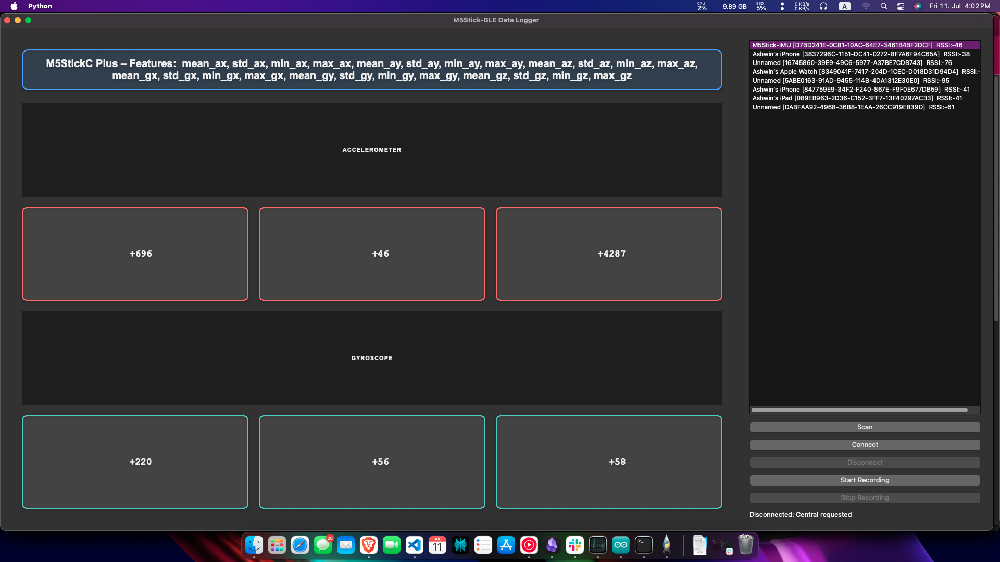
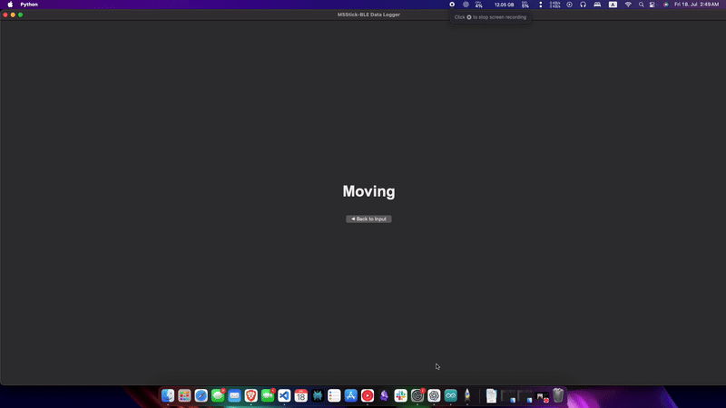

# M5Stick BLE Data Logger

This is a **PySide6 desktop application** that connects to an **M5StickC Plus** device over **Bluetooth Low Energy (BLE)**. It allows you to **stream, record, and segment IMU sensor data** (accelerometer + gyroscope) for activity recognition, TinyML, or time-series analysis tasks.

You can use this tool for **real-time sensor data logging**, **data labeling**, and **TinyML dataset preparation**.

---

## 🧪 Data Collection

### ✅ Download the App

You can find fully built versions for Windows, macOS, and Linux in the **GitHub Actions** build artifacts.

> Once downloaded and installed, you’ll see a screen like this:

---

### 🔌 Flash Your M5StickC Plus

Before collecting data, flash your M5StickC Plus with this firmware:

👉 [View Arduino sketch (Gist)](https://gist.github.com/ashdriod/c15db3928ddde2ea10db1ebbd830f95e)

This firmware:
- Streams **raw IMU packets** over BLE
- Computes and sends **feature vectors** every second
- Includes BLE UUIDs that the app listens to

---

### 🧭 How to Use the App (Step-by-Step)

1. **Power on your M5StickC Plus** after flashing the firmware.
2. Open the desktop app.
3. Click **🔍 Scan**.
   - You’ll see your M5Stick device (e.g., `M5Stick-IMU`) in the list.
4. Select the device and click **✅ Connect**.
5. Once connected, click **⏺ Start Recording**.
   - This will begin recording both **raw data** and **feature vectors** into two separate CSV files.
6. During recording, you can use **Segment 1 / Segment 2 / Segment 3** buttons to label different activity phases (e.g., Walking, Sitting, Running).
   - These segment labels will be recorded alongside your data in the CSV.
7. When done, click **⏹ Stop Recording**.
8. Click **🔌 Disconnect** when you're finished.
   - You can reconnect again anytime and repeat the process.

---

### 📁 Output Files

- `raw_data_*.csv` → Contains raw IMU data: 10x6 int16 values per packet
- `features_*.csv` → Contains feature rows with segment labels
- Both include timestamps and segment markers for easy training

---

---

## 🤖 TinyML Prediction Output

This mode allows you to view **live predictions** from a TinyML model running directly on the M5StickC Plus.

---

### ✅ Step-by-Step Instructions

1. **Flash your M5StickC Plus** with the TinyML prediction firmware.

   👉 [View TinyML BLE Arduino Code (Gist)](https://gist.github.com/ashdriod/8426586ab28beff912e39af4f044e452)

   > This firmware runs a trained ML model (e.g., Edge Impulse) on raw IMU data, and sends predictions like "Still" or "Moving" over BLE.

2. **Launch the App** (same one used for data collection).

3. Click **🔍 Scan** to find your device (`TinyML-M5`), and then click **✅ Connect**.

4. Once connected, scroll down and click the **👁 Show Output** button.

   > This will activate live BLE updates from the device’s prediction characteristic.

---

### 🎥 What It Looks Like

Below is an example of what the GUI displays when predictions are being streamed from the M5StickC Plus:

> The output updates every 0.5 seconds and shows predicted labels such as “Still”, “Moving”, etc.

---

---

### ⚠️ Attention Mac Users (M-series)

This app was developed and built on macOS, specifically for **M-series (Apple Silicon)** devices.

If you try to run it the usual way (e.g., from GitHub Actions builds for Windows/Linux), you may run into macOS security restrictions — gatekeeper, app signing, notarization, etc.

✅ For convenience, I’ve already built the app locally and placed the full **macOS build** inside the `dist/` folder.

> Inside `dist/M5StickDataLogger/`, you’ll find:
> - `M5StickDataLogger` (app folder)
> - `M5StickDataLogger` (Unix executable file) ← **Run this to launch the app**

🧩 You might need to:
- Enable **Bluetooth permissions** for the app in System Settings
- Restart the app once after first launch

If you're familiar with macOS app builds and permissions, feel free to try running directly from GitHub Actions too. But for most users, the local `dist/` build should work out of the box.

Thank you and enjoy logging your M5Stick data!

